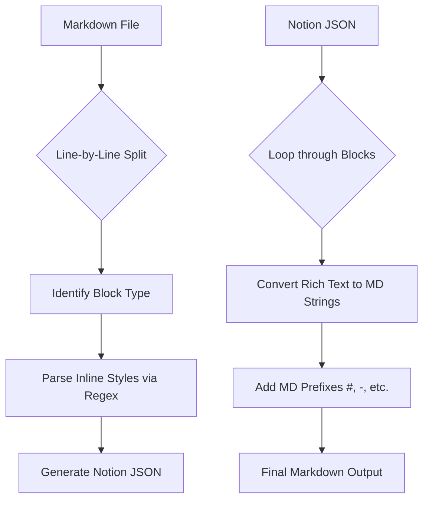

# Notion Parser Guide

This guide explains how the `notion_parser.py` script converts Markdown files into Notion blocks and vice versa.

## Overview

The parser acts as a bridge between standard Markdown text and the structured JSON format that the Notion API requires. It works in two main directions:
1. **Markdown → Notion Blocks**: Used when uploading local notes to Notion.
2. **Notion Blocks → Markdown**: Used when downloading or viewing Notion content in the terminal.

---

## How it Works (Markdown to Notion)

The conversion happens in two layers: **Blocks** and **Inline Text**.

### 1. Block Parsing
The parser reads your Markdown file line-by-line to identify the "type" of content:
- **Headers**: Lines starting with `#`, `##`, or `###` become `heading_1`, `heading_2`, or `heading_3`.
- **Toggleable Headings**: `# [toggle]`, `## [toggle]`, and `### [toggle]` become toggleable heading blocks with `is_toggleable: true`.
- **Toggle Children**: Indent content under a toggleable heading by two spaces to nest it under that heading.
- **Lists**: Lines starting with `-` or `*` become `bulleted_list_item`.
- **Checklists**: Lines like `- [ ]` or `- [x]` become `to_do` blocks.
- **Quotes**: Consecutive lines starting with `> ` are grouped into a single multiline `quote` block.
- **Callouts**: Alert syntax like `> [!WARNING]` starts a `callout` block, and following `> ` lines are included in the same multiline callout.
- **Paragraphs**: Anything else is treated as a standard paragraph.
- **Link to Page**: A line like `[[link_to_page page_id:...]]` or `[[link_to_page database_id:...]]` becomes a Notion `link_to_page` block.

### 2. Inline Text (The "Rich Text" Layer)
Once a block is identified, the parser looks *inside* the text for styling:
- **Bold**: `**text**` or `__text__`
- **Italic**: `*text*` or `_text_`
- **Bold + Italic**: `***text***`

**Example:**
Input: `## This is **bold**`
1. The parser identifies the `##` and creates a **Heading 2** block.
2. It then scans "This is **bold**" and creates two pieces of "rich text":
   - "This is " (Plain)
   - "bold" (Annotated as **Bold**)

---

## How it Works (Notion to Markdown)

When pulling data from Notion, the process is reversed:
1. It looks at the block `type` (e.g., `to_do`).
2. It checks properties (e.g., is `checked` true or false?).
3. It converts the "rich text" array back into a single string with `**` or `*` markers.
4. It prepends the correct Markdown symbol (like `- [x] `).
5. `link_to_page` blocks are emitted as `[[link_to_page page_id:...]]` or `[[link_to_page database_id:...]]` so they can round-trip through markdown.

---

## Technical Flow

## Supported Syntax Examples

| Markdown | Notion Block Type | Notes |
| :--- | :--- | :--- |
| `# Title` | `heading_1` | Supports up to level 3 |
| `# [toggle] Section` | `heading_1` | Sets `is_toggleable: true` |
| `## [toggle] Section` | `heading_2` | Sets `is_toggleable: true` |
| `### [toggle] Section` | `heading_3` | Sets `is_toggleable: true` |
| `  Nested text` under a toggle | child block | Two-space indent nests content inside the toggle |
| `- Item` | `bulleted_list_item` | |
| `- [x] Done` | `to_do` | `checked: true` |
| `> quoted line` | `quote` | Consecutive quoted lines are grouped |
| `> [!INFO] Hi` | `callout` | Uses ℹ️ icon and supports `> ` continuation lines |
| `[TOC]` | `table_of_contents` | Special placeholder |
| `[[link_to_page page_id:...]]` | `link_to_page` | Also supports `database_id` |

## Command Usage
- **To Notion JSON**: `python3 lib/notion_parser.py my_note.md`
- **From Notion JSON**: `cat blocks.json | python3 lib/notion_parser.py --reverse`
